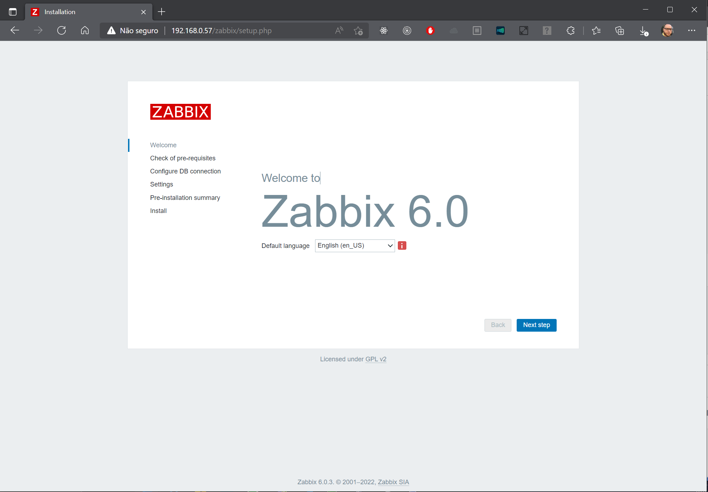
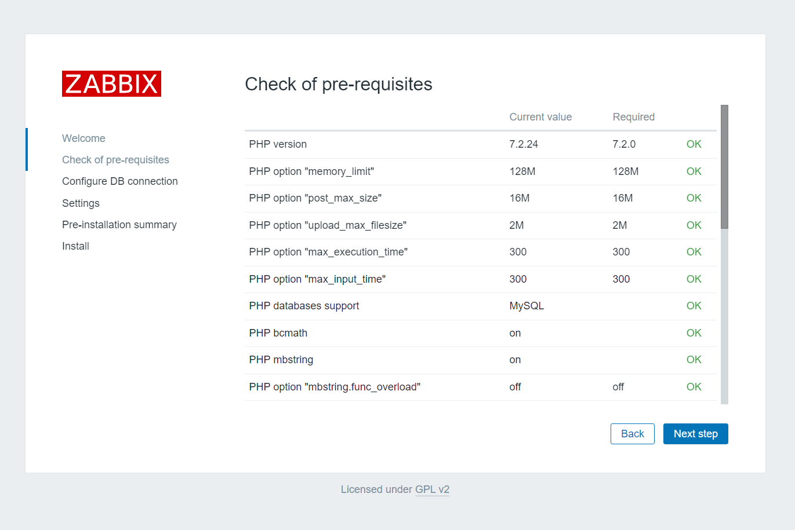
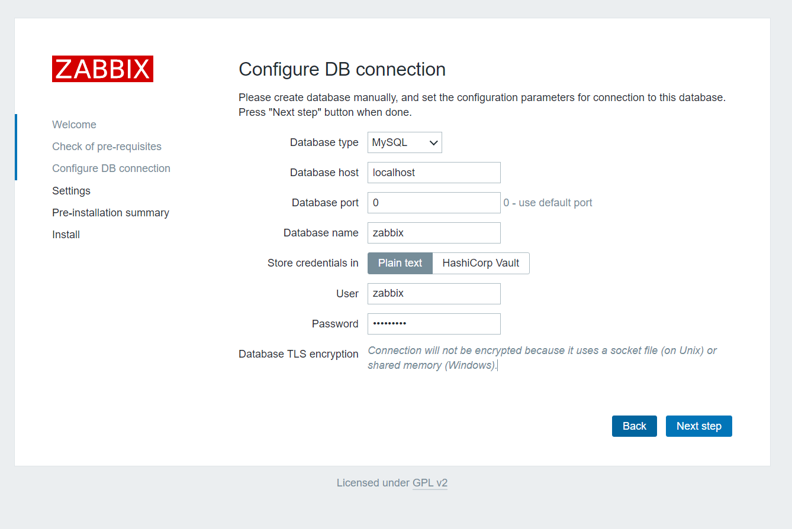
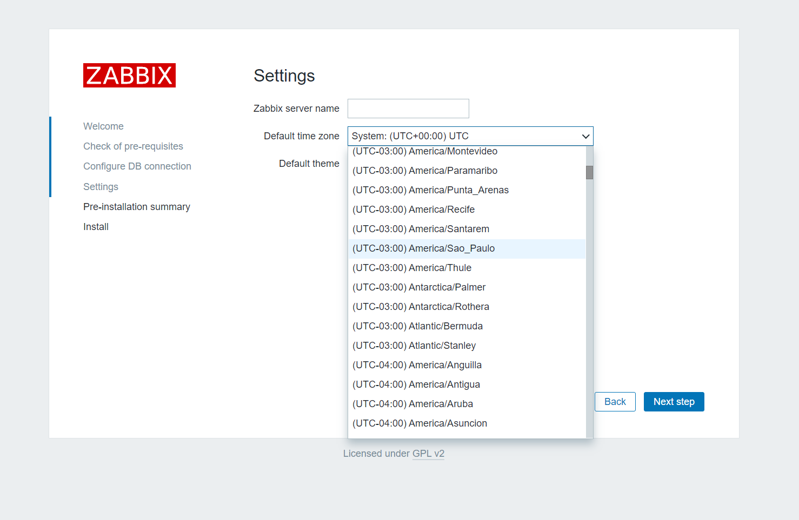
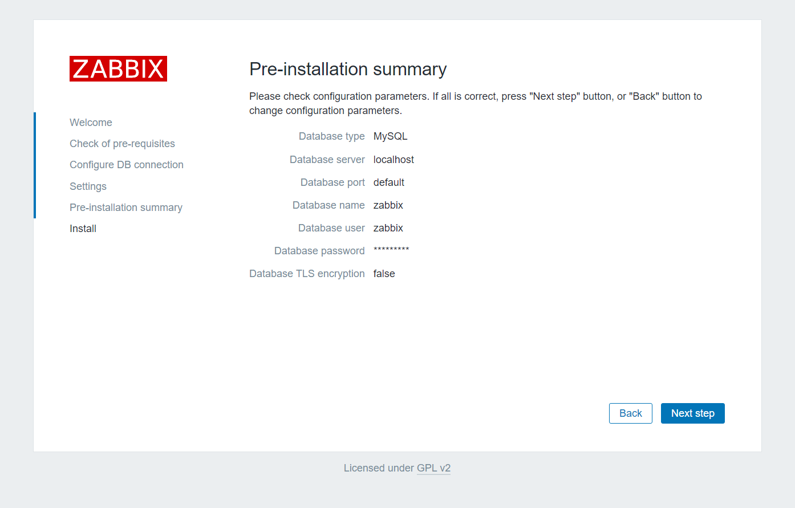
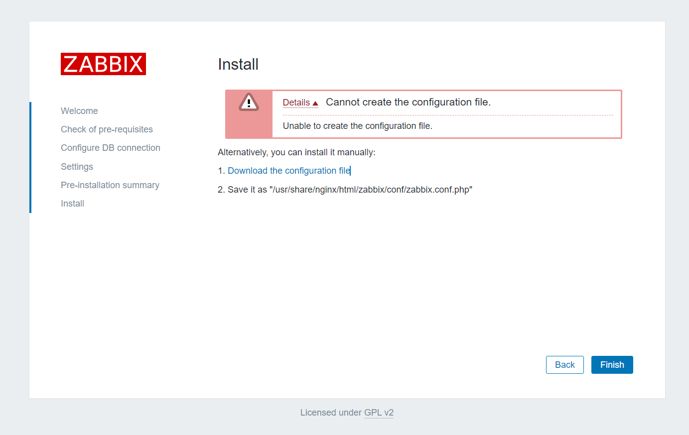
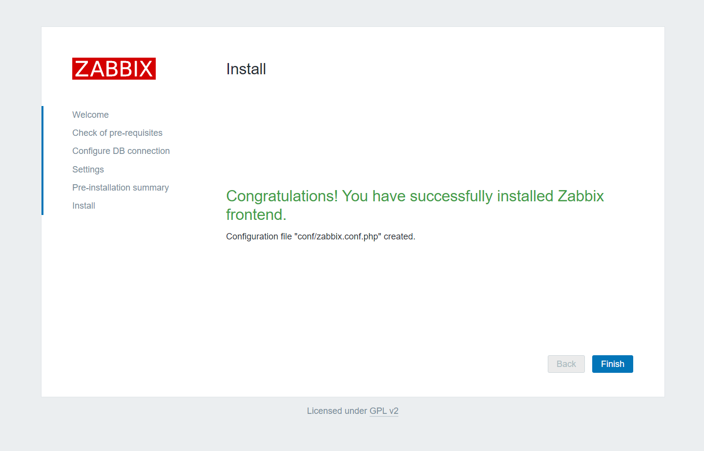
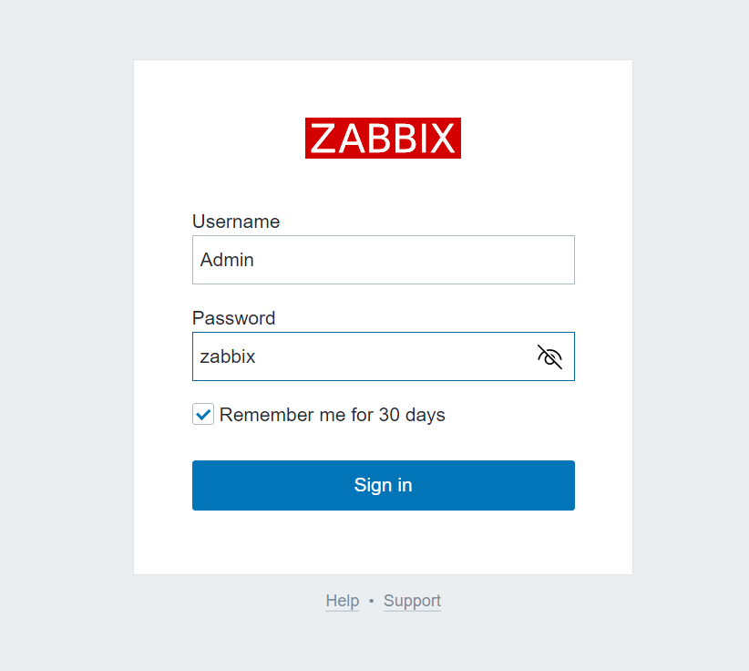
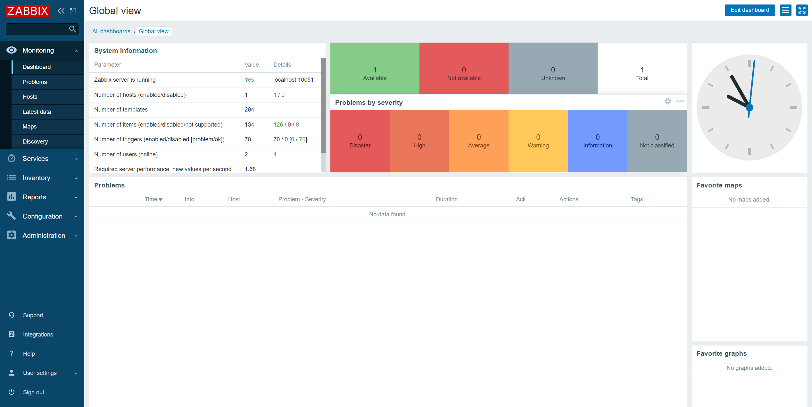

# Zabbix Lab
## Visão Geral
Esse repositório serve de Tutorial para instalação e configuração do Zabbix Server e demais componentes. 

### O que é o Zabbix?

- Solução Open Source de monitoramento
- Monitorar a saúde, disponibilidade e performance de ativos ou serviços de TI
	- Exemplo: servidores, serviços em nuvem, API, ar-condicionado, roteadores, est.
- Monitoramento com e sem agente
- 100% web (administração e visualização)
- Notificações (tela, Telegram, SMS, e-mail etc.)

### Para que server?

Alguns casos de uso do Zabbix: 
- Verificar tempo de autonomia do no-break
- Verificar consumo de links de dados
    - Mostrar consumo mês a mês
- Verificar quantidade de chamados atendidos
- Monitorar temperatura de um data center
- Monitorar a quantidade de usuários comprando um produto
- Monitorar a quantidade de ligações recebidas

### Benefícios 
- Recuperação automática de problemas
- Atuar antes da parada ou degradação (agir ou acionar time responsável)
- Prever quando um problema irá acontecer
- Monitoramento de nível de serviço SLA (Service Level Agreement)
- Gera dashboard operacionais e executivos com indicadores de serviço
- Escalonamento de problema
    - Exemplo, notificar os técnicos, coordenador e gerentes baseados no tempo que o problema demora para ser resolvido
- Monitoramento com criptografia de dados
- Criar um NOC (Network Operation Center) avançado
- Maior controle dos ativos (inventários e relatórios)
    - Saber quais são os ativos Gerenciamento de Ativo de TI
    - Controlar as modificações na configuração nos ativos Gerenciamento de Configuração do Serviço
- Gestão de capacidade Gerenciamento de Capacidade e Desempenho
- Eleva a imagem da equipe de TI trazendo maior profissionalismo
    - Aproximando a TI da estratégia da companhia e alinhando TI aos interesses de negócio
### Arquitetura do Zabbix
- Possui 3 componentes e pode ser distribuído ou não
    - **Zabbix Server**
        - Responsável por processar e armazenar os dados coletados e enviar notificações
        - Possui frontend web e o banco de dados
        - Coleta ou recebe métricas de monitoramento
        - Analisa e processa as informações
        - Envia notificação de falha e recuperação de serviço
        - Hospeda:
            - Arquivos de configuração do ambiente
            - Database (configuração e métricas de monitoramento)
            - Web frontend (administração e visualização de dados)
            
    - **Zabbix Proxy**
        - Responsável por intermediar a comunicação entre os ativos monitorados e o Zabbix Server
    - **Zabbix Agent**
        - Recebe instruções de coleta e disponibiliza ao Zabbix Server ou ao Zabbix Proxy

## Pré-requisitos
Esse tutorial se baseia em uma máquina Windows 10. Você pode executá-lo no Linux, porém os ajustes necessários são por sua conta. 

- **Vagrant**: Instale o Vagrant a partir do endereço https://www.vagrantup.com/downloads
- **VirtualBox**: Para executar o Lab você precisa instalar o Oracle VirtualBox. Você pode fazer o download do VirtualBox em https://www.virtualbox.org/wiki/Downloads
- **Git**: você precisa instalar o git e baixar o conteúdo desse repositório. Para instalar o git use o link https://git-scm.com/downloads. Para baixar esse repositório basta executar o comando ```git clone git@github.com:compadrejunior/zabbix-lab.git```
- **Editor de Texto**: Eu recomendo o uso do Visual Studio Code para visualizar e editar os arquivos desse repositório.
- **Terminal**: Você pode usar o terminal do Windows mas eu recomendo usar o gitbash por ele utilizar uma sintaxe semelhante ao Linux que eu vou utilizar nesse tutorial. 

## Dependências
Os pacotes abaixo serão instalados durante o tutorial ou estão pré-configurados e você não precisa baixar antes:
- CentOS/stream8: já vem configurado no Vagrantfile
- MySQL Server: já vem provisionado no Vagrantfile do server.


## Iniciando as VMs do Laboratório
1. Inicie o lab através do comando abaixo.   
    > **Observação**: Usaremos máquinas virtuais para o laboratório. Essas máquinas estão configuradas no arquivo Vagrantfile desse repositório que você deve baixar conforme a seção de pré-requisitos. Para executar os comandos abaixo use o terminal do Linux, Windows ou GitBash. É importante estar na pasta raiz do repositório desse tutorial (ex. ZABBIX-LAB). 

    ```bash
    vagrant up
    ```

2. Conecte na máquina através do comando abaixo:

    ```bash
    vagrant ssh server
    ```

3. Desligue a máquina virtual usando o comando abaixo:

    ```bash
    sudo shutdown -h now 
    ```
## Instalando e configurando o Zabbix Server

Os passos abaixo foram baseados na versão 6.0 do Zabbix. Você pode opcionalmente seguir o tutorial disponível no link https://www.zabbix.com/br/download?zabbix=6.0&os_distribution=centos&os_version=8&db=postgresql&ws=nginx

> **Importante**: A partir desse ponto você não deve mais executar o comando vangrant destroy para parar as máquinas ou terá que refazer todo o procedimento. Para parar as máquinas sem destruir o seu progresso use o comando ```vagrant halt -f```. Recomendo fazer um clone ou backup das VMs ao final do tutorial. 


1. Digite o comando abaixo para se conectar no servidor 
    ```bash
    vagrant ssh server
    ```

2. Execute o comando abaixo para baixar o pacote de instalação.

    ```bash
    sudo rpm -Uvh https://repo.zabbix.com/zabbix/6.0/rhel/8/x86_64/zabbix-release-6.0-1.el8.noarch.rpm
    ```

3. Instale o servidor, o frontend e o agente Zabbix:

    ```bash
    sudo dnf clean all
    sudo dnf -y install zabbix-server-mysql zabbix-web-mysql zabbix-nginx-conf zabbix-sql-scripts zabbix-selinux-policy zabbix-agent
    ```

4. Definindo uma senha para o usuário root no servidor digitando o comando abaixo e especificando uma senha forte.

    ```bash
    sudo passwd root
    ```
5. Habilite as opções de segurança do MySQL através do comando abaixo

    ```bash
    sudo mysql_secure_installation
    ```
    > **Observação**: Caso o comando responda com a mensagem ```Error: Can't connect to local MySQL server through socket '/var/lib/mysql/mysql.sock' (2)``` certifique-se que o mysql está executando com o comando ```sudo service mysqld start```

6. Responda as questões com os seguintes valores:

    6.1 y para validar a senha.

    6.2 2 par definir a política de senha.

    6.3 Digite a senha para o usuário root do MySQL.

    6.4 Digite novamente a senha para o usuário root do MySQL.

    6.5 y para prosseguir.

    6.6 y para remover acesso anonimo. 

    6.7 y para impedir acesso remoto com o usuário root. 

    6.8 y para remover a base de dados de teste. 

    6.9 y para atualizar a tabela de privilégios.

7. Criar banco de dados inicial. 

    > **Observação**: Substitua o valor senha do primeiro comando com a senha do usuário root definido anteriormente. Na linha ```create user zabbi@... ``` defina a senha que deseja utilizar para o banco de dados do Zabbix no MySQL. 

    ```bash
    mysql -u root -p
    password
    mysql> create database zabbix character set utf8mb4 collate utf8mb4_bin;
    mysql> create user zabbix@localhost identified by 'password';
    mysql> grant all privileges on zabbix.* to zabbix@localhost;
    mysql> quit;
    ```

8. Importe o esquema do Zabbix com o comando abaixo:

    ```bash
    sudo zcat /usr/share/doc/zabbix-sql-scripts/mysql/server.sql.gz | mysql -uzabbix -p zabbix
    ```

9. Configure o banco de dados para o servidor Zabbix. Edite o arquivo /etc/zabbix/zabbix_server.conf informando o parâmetro DBPassword=password, onde password deve ser substituído pela senha do usuário do Zabbix no servidor MySQL. 

10. Configure o arquivo /etc/zabbix/zabbix_agentd.conf, alterando a string Hostname de Hostname=Zabbix Server para Hostname=zabbix-server.

10. Configure o PHP para o frontend Zabbix
Editar arquivo /etc/nginx/conf.d/zabbix.conf, descomente e defina as diretivas 'listen' e 'server_name'.

11. Inicie o servidor Zabbix e os processos do agente e configure-os para que sejam iniciados durante o boot do sistema.

    ```bash
    sudo systemctl restart zabbix-server zabbix-agent nginx php-fpm
    sudo systemctl enable zabbix-server zabbix-agent nginx php-fpm
    ```

## Instalando e configurando o Front-end do Zabbix Server

1. No servidor do Zabbix digite o comando abaixo:
    ```bash
    sudo yum install -y wget
    ```

2. Baixe o pacote do Front-end com o comando abaixo:
    ```bash
    wget https://cdn.zabbix.com/zabbix/sources/stable/6.0/zabbix-6.0.3.tar.gz
    ```
    > **Observação**: caso o arquivo não esteja disponível ao tentar fazer o download. Procure a versão apropriada em https://www.zabbix.com/download_sources e substitua a URL no comando wget.

3. Descompacte o arquivo:
    ```bash
    tar -zxvf zabbix-6.0.3.tar.gz
    ```

4. Copie os arquivos da interface gráfica para o diretório do html do NGINX com o comando abaixo
    ```bash
    sudo cp -r zabbix-6.0.3/ui/ /usr/share/nginx/html/zabbix
    ```
5. Edite o arquivo /etc/php.ini e altere os parâmetros abaixo para os valores especificados. 

    | Parâmetro          | Valor |
    | ------------------ | ----- |
    | post_max_size      | 16M   |
    | max_execution_time | 300   |
    | max_input_time     | 300   |

6. Reinicie os serviços:

    ```bash
    sudo systemctl restart zabbix-server zabbix-agent nginx php-fpm
    ```

7. Acesse a interface web pelo browser usando o endereço http://[ip-do-servidor]/zabbix, substituindo [ip-do-servidor] pelo endereço IP do seu servidor do Zabbix. Você pode obter o endereço pelo comando ```ip a``` no terminal do servidor. Por exemplo, http://192.168.0.57/zabbix/

    

8. Prossiga com a instalação clicando em Next step e verificando se os pré-requisitos estão todos OK depois clique novamente Next step.

    

9. Na tela de configuração do banco de dados, forneça a senha de usuário do Zabbix no MySQL criada anteriormente e clique em Next step. 

    

10. Configure o horário correto do seu servidor conforme a tela abaixo e clique ne Next step. 

    

11. Clique novamente em Next Step.

    

12. Clique em Next Step. 

    

13. Faça o download do arquivo e salve o no servidor no caminho /usr/share/nginx/html/zabbix/conf/zabbix.conf.php. O meio mais fácil de fazer isso é salvando o arquivo na pasta do projeto Zabbix-Lab na sua máquina local e depois copiando o arquivo através dos comandos abaixo:

    13.1 Saia da VM
    
    ```bash
    logout
    ```

    13.2 Instale o plugin vagrant-scp
    
    ```bash
    vagrant scp zabbix.conf.php server:/home/vagrant
    ```
    
    13.3 Entre na VM novamente

    ```bash
    vagrant ssh server
    ```


    13.3 Copie o arquivo para o diretório /usr/share/nginx/html/zabbix/conf.

    ```bash
    sudo cp zabbix.conf.php /usr/share/nginx/html/zabbix/conf/zabbix.conf.php
    ```

14. Volte ao Browser e clique em Next Step

     

15. Clique em Finish.

16. Faça o login usando o usuário Admin e senha zabbix.

    

17. Parabéns! Você entrou no Zabbix

     

18. Para parar todas as vms execute os comandos abaixo.

    ```bash
    logout
    vagrant halt -f
    ```

